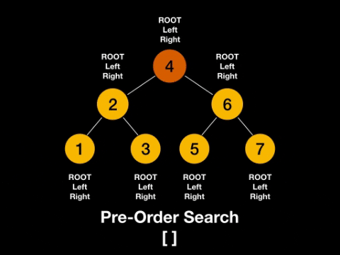

# Binary Trees and Binary Search Tree (BST)

### Tree
A **tree** is an **undirected graph** which satisfies any of the following definitions:
- An acyclic connected graph.
- A connected graph with N nodes and N-1 edges.
- A graph in which any two vertices are connected by exactly one path.

### Leaf Node
A **leaf node** is a node with no children. These have been highlighted as blue.


### Sub Tree
A **subtree** is a tree entirely contained within another. They are usually denoted using triangles.
- **Note**: Subtrees may consist of a single node!.


### Binary Tree
A **binary tree** is a tree for which every node has at most two child nodes.


### Binary Search Tree (BST)
A **binary search tree** is a binary tree that satisfies the **BST invariant**: left subtree has smaller element and right subtree has larger elements.


**When and where are Binary Trees used?**
1. Binary Search Trees (BSTs).
    - Implementation of some map and set ADTs.
    - Red Black Trees.
    - AVL Trees.
    - Splay Trees.
    - etc.
2. Used in the implementation of binary heaps.
3. Syntax trees (used by compiler and calculators).
4. Treap - a probabilistic data structure (uses a randomized BST).

### Complexity of BSTs

| Operation | Average   | Worst |
|-----------|-----------|-------|
| Insert    | O(log(n)) | O(n)  |
| Delete    | O(log(n)) | O(n)  |
| Remove    | O(log(n)) | O(n)  |
| Search    | O(log(n)) | O(n)  |

### Adding elements to a BST
- Binary Search Tree (BST) elements must be comparable so that we can order them inside the tree.
- When inserting an element we want to compare its value to the value stored in the current node we're considering to decide on one of the following:
  - Recurse down left subtree (< case). 
  - Recurse down right subtree (> case). 
  - Handle finding a duplicate value (= case).
  - Create a new node (found a null leaf).


### Removing elements from a BST
- Removing elements from a BST can be seen as a two-step process.
  1. **Find** the element we wish to remove (if it exists)
  2. **Replace** the node we want to remove with its successor (if any) to maintain the BST invariant.
- Recall the **BST invariant**: left subtree has smaller elements and right subtree has larger elements.
  1. Node to remove is a leaf node
  2. Node to remove has a right subtree but no left subtree
  3. Node to remove has a left subtree but no right subtree
  4. Node to remove has a both a left subtree and a right subtree


### Find Phase
- When searching our BST for a node with a particular value one of four things will happen.
  1. We hit a **_null node_** at which point we know the value does not exist within our BST.
  2. Comparator value **_equal to 0_** (found it!).
  3. Comparator value **_less than 0_** (the value, if it exists, is in the left subtree).
  4. Comparator value **_greater than 0_** (the value, if it exists, is in the right subtree).


### Tree Traversals
#### (Preorder, Inorder, Postorder & Level order)
- Preorder prints _before_ the recursive calls.
```
preorder(node):
    if node == null:
        return
    print(node.value)
    preorder(node.left)
    preorder(node.right)
```


- Inorder prints _between_ the recursive calls.
```
inorder(node):
    if node == null:
        return
    inorder(node.left)
    print(node.value)
    inorder(node.right)
```


- Postorder prints _after_ the recursive calls.
```
postorder(node):
    if node == null:
        return
    postorder(node.left)
    postorder(node.right)
    print(node.value)
```


- Level order traversal: In a level order traversal we want to print the nodes as they appear one layer at a time.

### Breadth First Search (BFS)
A **Breadth First Search** (BFS) works from the root node down to the leaf node.
- To do a BFS we'll need to maintain a _Queue_ of the nodes left to explore.
  - At each iteration we add the left child and then the right child of the current node to our Queue. 


