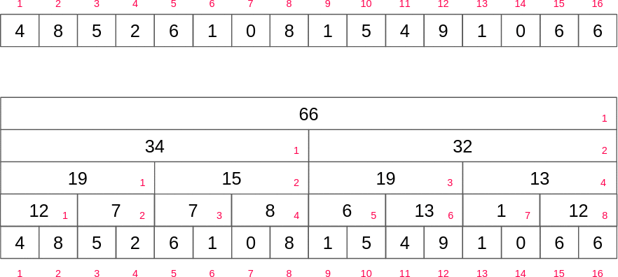

# Fenwick Tree (Binary Indexed Tree)
A **Fenwick Tree (Binary Indexed Tree)** is a data structure that supports sum range queries as well as setting values in a static array and getting the value of prefix sum up some index efficiently.

### Complexity
| Operation      | Big-O     |
|----------------|-----------|
| Construction   | O(n)      |
| Point Update   | O(log(n)) |
| Range Sum      | O(log(n)) |
| Range Update   | O(log(n)) |
| Adding Index   | N/A       |
| Removing Index | N/A       |

### Fenwick Tree Range Queries
* Unlike a regular array, in a Fenwick tree a specific cell is responsible for other cells as well.
* The position of the **least significant bit (LSB)** determines the range of responsibility that cell has to the cells below itself.
* In a Fenwick tree we may compute the **prefix sum** up to a certain index, which ultimately lets us perform range sum queries.

### Fenwick Tree Point Updates
* Instead of querying a range to find the interval sum, we want to update a cell in our array.
* Recall that with range queries we cascaded down from the current index by **continuously removing the LSB**.
* Point updates are the opposite of removing the LSB, we want to **add the LSB** to propagate the value up to the cells responsible for us.

### Fenwick Tree Construction 
#### Naive Construction
Let A be an array of values. For each element in A at index _'i'_ do a point update on the Fenwick tree with a value of A[i]. There are _'n'_ elements and each point update takes O(log(n)) for a total of **_O(nlog(n))_**.  

#### Linear Construction
**Idea:** Add the value in the current cell to the **immediate cell** that is responsible for us. This resembles what we did for point updates but only one cell at a time.
This will make the 'cascading' effect in range queries possible by propagating the value in each cell throughout the tree.