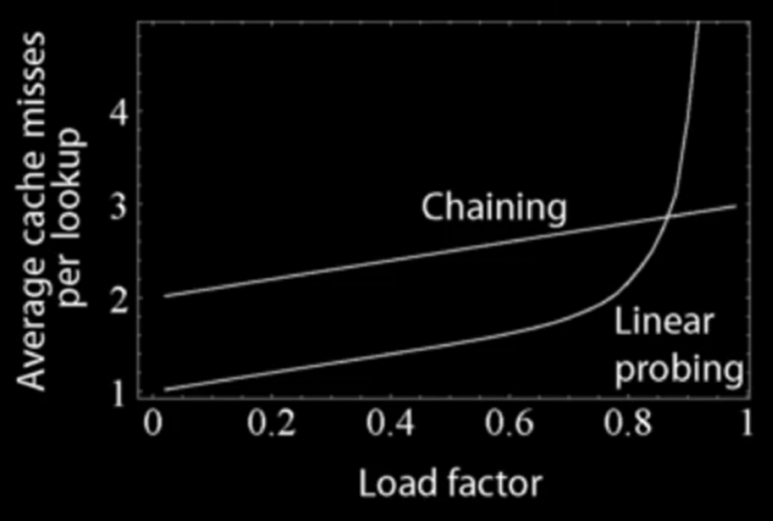

# Hash Table
A **Hash Table (HT)** is a data structure that provides a mapping from keys to values using a technique called **hashing**.

- HTs are often used to track item frequencies. For instance, counting the number of times a word appears in a given text.

### Properties of Hash Function
If **H(x) = H(y)** then objects x and y **might be equal**, but if **H(x) != H(y)** then x and y are **certainly not equal**.

### How does a hash table work?
- **Separate chaining** deals with hash collisions by maintaining a data structure (usually a linked list) to hold all the different values which hashed to a particular value.
- **Open addressing** deals with hash collisions by finding another place within the hash table for the object to go by offsetting it from the position to which it hashed to.

### Complexity

| Operation | Average | Worst |
|-----------|---------|-------|
| Insert    | O(1)*   | O(n)  |
| Delete    | O(1)*   | O(n)  |
| Search    | O(1)*   | O(n)  |
/*The constant time behaviour attributed to hash table is only true if you have a good **uniform hash function**./

### Hash Table Separate Chaining
**Separate Chaining** is one of many strategies to deal with hash collisions by maintaining a data structure (usually a linked list) to hold all the different values which hashed to a particular value.

- **NOTE:** The data structure used to cache the items which hashed to a particular value is not limited to a linked list. Some implementations use one or a mixture of: arrays, binary trees, self-balancing trees and etc...

### Open Addressing
- The goal of the **Hash Table (HT)** is to construct a mapping from keys to values.
- Keys must be **hashable**, and we need a **hash function** that converts keys to whole numbers.
- We use the hash function defined on our key set to **index into** an array (the hash table).
- Hash functions are not perfect, therefore sometimes two keys k1, k2 (k1 != k2) hash to the same value. When this happens we have a **hash collision** (i.e **H(k1) = H(k2)**)
- **Open addressing** is a way to solve above issue.

* When using open addressing  as a collision resolution technique the **key-value pairs are stored in the table (array) itself** as opposed to a data structure like in separate chaining.
* This means we need to care a great deal about the size of our hash table and how many elements are currently in the table.
```
Load factor = items in table/ size of table
```



- The **O(1)** constant time behaviour attributed to hash tables assumes the load factor (α) is kept below a certain fixed value. This means once α > **threshold** we need to grow the table size (ideally exponentially e.g. double).
- When we want to insert a key-value pair (k, v) into the hash table we hash the key and obtain an original position for where this key-value pair belongs, i.e H(k).
- If position of our key hashed to is occupied we try another position in the hash table by offsetting the current position subject to a **probing sequence P(x)**. We keep doing this until an occupied slot is found.
- There are an infinite amount of probing sequences you can come up with, here are a few;
* **_Linear probing:_**
```
P(x) = ax + b   #where a, b constants
```
* **_Double hashing:_**
```
P(x) = ax^2 + bx + c   #where a, b, c constants
```
* **_Pseudo random number generator:_**
```
P(k, x) = x*RANDOM(H(k),x) + b   #where RANDOM is a random number generator function seeded with H(k)
```
- General insertion method for open addressing on a table of size 'n' goes as follows;
```
x = 1
keyHash = H(k)
index = keyHash
while table[index] != null:
    index = (keyHash + P(k, x)) mod n
    x += 1
insert (k,v) at table[index]

Where H(k) is the hash for the key k and P(k,v) is the probing function
```
#### Open addressing big issue
#### Chaos with cycles
- Most randomly selected probing sequences modulo 'n' will produce a cycle shorter than the table size.
- This becomes problematic when you are trying to insert a key-value pair and all the buckets on the cycle are occupied because you will get stuck in an **infinite loop**!
- Techniques such as **linear probing**, **quadratic probing**, **double hashing** are all subject to the issue of causing cycles which is why the **probing functions used with these methods are very specific**.
- Notice that open addressing is very sensitive to the hashing function and probing function used. This is not something you have to worry about (as much) if you are using **separate chaining** as a collision resolution method.

