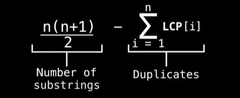

# Suffix Array
#### What is a suffix
A suffix is a substring at the end of a string of characters. For our purposes suffixes are non-empty.

#### What is a Suffix Array
- A suffix array is an array which contains all the sorted suffixes of a string.
- The suffix array provides a space efficient alternative to a suffix tree which itself is a compressed version of a trie.
- **NOTE:** Suffix arrays can do everything suffix trees can, with some additional information such as the Longest Common Prefix (LCP) array.

### The Longest Common Prefix (LCP) Array
- The LCP array is an array in which every index tracks how many characters two sorted adjacent suffixes have in common.
- By convention, LCP[0] is undefined, but for most purposes it's fine to set it to zero.
- **NOTE:** There exists many methods for efficiently constructing the LCP array in O(nlog(n)) and O(n).

#### Using SA/LCP array to find unique substrings
- The problem of finding/counting all the unique substrings of a string is a commonplace problem in computer science.
- The naive algorithm generates all substrings and places them in a set resulting in a O(n^2) algorithm.
- A better approach is to use the LCP array. This provides not only a quick but also a space efficient solution.

#### Finding Unique Substrings
```
Number of substrings - Duplicates
```


### Longest Common Substring (LCS)
- One approach is to use dynamic programming running in O(n1*n2*n3...*nm), where ni is the length of the string Si. This may be ok for a few  small strings, but rapidly gets unwieldy.
- An alternative method is to use a suffix array which can find the solution in O(n1+n2+...+nm) time.

### LCS Algorithm
- Things can get more messy when suffixes of different colors are not exactly adjacent.
- Use a **sliding window** to capture the correct amount of suffix colors. At each step advance the bottom endpoint or adjust the top endpoint such that the window contains exactly K suffixes of different colors.
- For each valid window perform a range query on the LCP array between the bottom and top endpoints. The LCS will be the maximum LCP value for all possible windows.
- Lucky for us, the **minimum sliding range query problem** can be solved in a total of O(n) time for all windows!
- Alternatively, you can use min range query data structure such as a segment tree to perform queries in log(n) time which may be easier but slightly slower running for a total of **O(nlog(n))**.

### Longest Repeated Substring (LRS)
- The longest repeated substring is yet another problem in computer science we can solve efficiently using the information stored in the LCP array.
- The brute force method requires O(n^2) time and lots of space. Using the information inside the LCP array saves you time and space.

