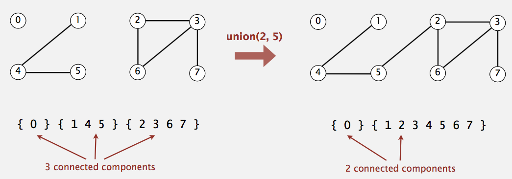
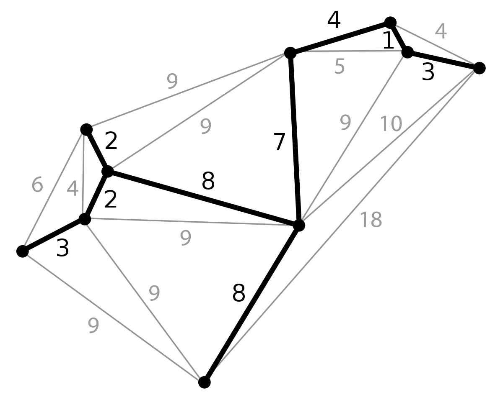

# Union Find
**Union Find** is a data structure that keeps track of elements which are split into one or more disjoint sets. Its has two primary operations; **_find_** and **_union_**

**When and where is a Union Find used?**
1. Kruskal's minimum spanning tree algorithm
2. Grid percolation
3. Network connectivity
4. Least common ancestor in trees
5. Image processing

### Complexity

| Operation          | UnionFind |
|--------------------|-----------|
| Construction       | O(n)      |
| Union              | α(n)      |
| Find               | α(n)      |
| Get component size | α(n)      | 
| Check if connected | α(n)      |
| Count components   | O(1)      |
* α(n) - Amortized constant time

#### Kruskal's Minimum Spanning Tree
- Given a graph G = (V, E) we want to find **Minimum Spanning Tree** in the graph (it may not be unique). A minimum spanning tree is a subset of the edges which connect all vertices in the graph with the minimal total edge cost.

1. Sort edges by ascending edge weight.
2. Walk through the sorted edge belongs to, if the nodes are already unified we don't include this edge, otherwise we include it and unify the nodes.
3. The algorithm terminates when every edge has been processed or all the vertices have been unified.

#### Creating Union Find
To begin using Union Find, first construct a **bijection** (a mapping) between your objects abd the integers in the range [0, n).
- **Note**: This step is not necessary in general, but it will allow us to construct an array-based union find.

##### Find Operation
To **find** which component a particular element belongs to find the root of that component by following the parent nodes until a self loop is reached (a node whose parent is itself).

##### Unit Operation
To **unify** two elements find which are the root nodes of each component and if the root nodes are different make one of the root nodes be the parent of the other.

***Remarks***
* In this data structure, we do not "un-union" elements. In general, this would be very inefficient to do since we would have to update all the children of a node.
* The number of components is equal to the number of roots remaining. Also, remark that the number of root nodes never increases.

